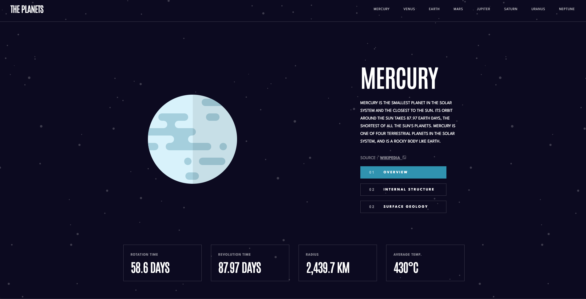

# Frontend Mentor - Planets fact site solution

This is a solution to the [Planets fact site challenge on Frontend Mentor](https://www.frontendmentor.io/challenges/planets-fact-site-gazqN8w_f). Frontend Mentor challenges help you improve your coding skills by building realistic projects.

## Table of contents

- [Overview](#overview)
  - [The challenge](#the-challenge)
  - [Screenshot](#screenshot)
  - [Links](#links)
  - [Built with](#built-with)
- [Author](#author)

**Note: Delete this note and update the table of contents based on what sections you keep.**

## Overview

### The challenge

Users should be able to:

- View the optimal layout for the app depending on their device's screen size
- See hover states for all interactive elements on the page
- View each planet page and toggle between "Overview", "Internal Structure", and "Surface Geology"

### Screenshot

### Links

- Solution URL: [github](https://github.com/mseidel819/planet-facts)
- Live Site URL: [netlify]()

### Built with

- TypeSceript
- [React](https://reactjs.org/) - JS library
- [Next.js](https://nextjs.org/) - React framework
- Sass - for styling

## Author

- Website - [Matt Seidel](https://seidelmatt.com)
- Frontend Mentor - [@mseidel819](https://www.frontendmentor.io/profile/mseidel819)
